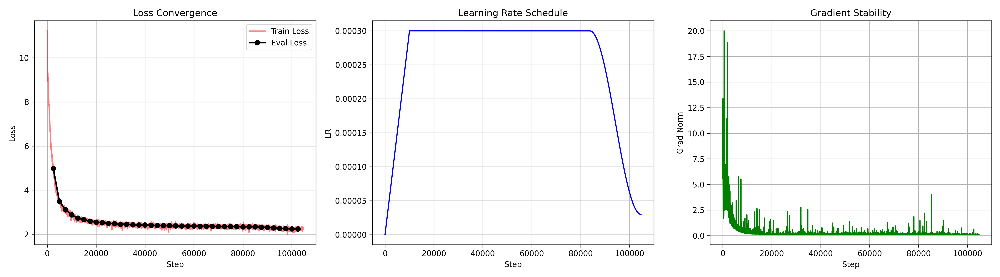
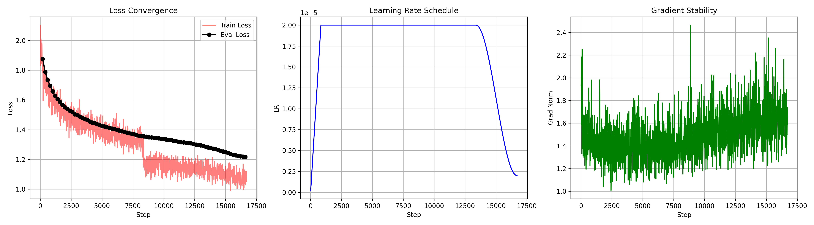
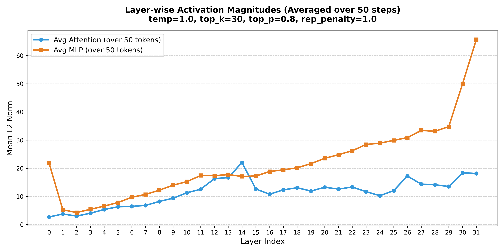
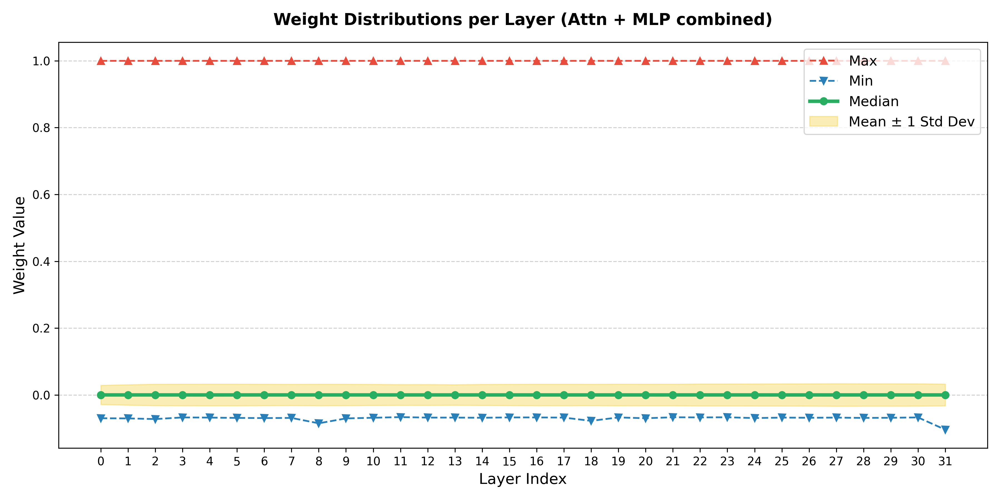

This is a Dense model 470M model trained on multilingual dataset with XSA Attention with custom tokenizer specialized on Englsih, Russian and Uzbek langauges.

# General Info
|Dataset info|Value|
|----|-----|
|Dataset size|100B|
|lr|3-e4|  
|batch size|1M|
|block size|2048|

|Model info|Value|
|----|-----|
|model dim|1024|
|ffn dim|2736|  
|layes|32| 
|head dim|128|
|embedings|65K|
|Attention type|XSA|
|FFN type|SwiGLU gated|
|Position embs|RoPE|
|Normalization|RMSNorm|

# Benchmarks
|Test|Value|
|----|-----|
|Hellaswag|50%|

# Charts
## pre-train (loss, lr, grand norm)

* train loss and graients are extremely stable due to large batch size 1M and appropriate shuffling. But why loss alsmost did not converge at the end is unknown, maybe I did something wrong :(

## fine-tune (loss, lr, grand norm)

* You can clearly see the train loss is dropped like from the stairs in the middle (this is due to 2 epoch start) but it is ok, typical fine tuning is run on 2 epoch. And gradiens going up at the end is common too in WSD scheduler as main learning happend at the end of training in decay phase (you can see it in train gradients too).

## some statistical charts (activation norm and weight distribution)

* weight distribution is mostly near 1.0 because it took maximum and minimum value, RMSNorm has a value of 1.0 by default and it is not changed a lot duting training so this is just visualization error.

# References
XSA->https://arxiv.org/pdf/2603.09078
SwiGLU gated->https://medium.com/@saeed.mehrang/swiglu-the-activation-function-powering-modern-llms-70ea5cfdeafe
RoPE->https://arxiv.org/pdf/2104.09864

# Model weights in Huggingface
repo name->firdavsus/LLM_D5
there are pre-train weights in pre_train/ folder and fine-tune weights in fine_tune/ folder
